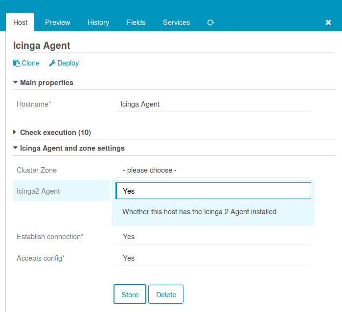
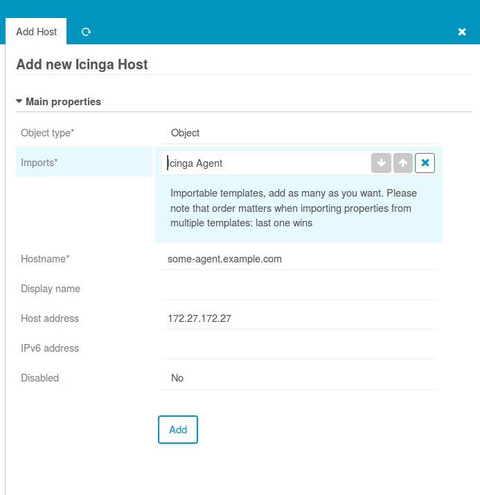
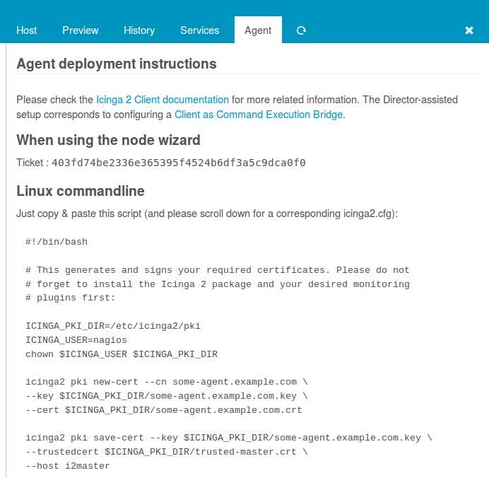
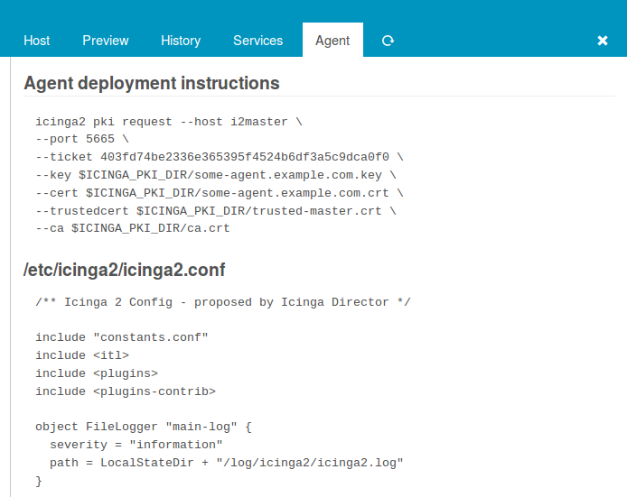
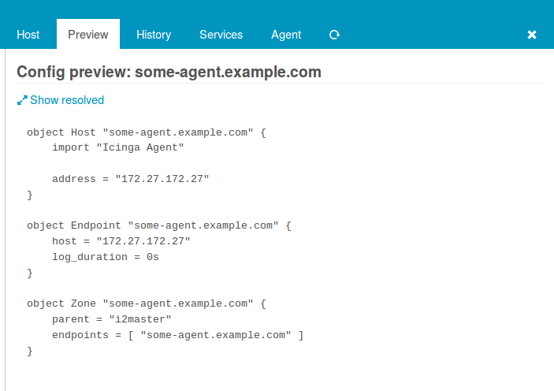
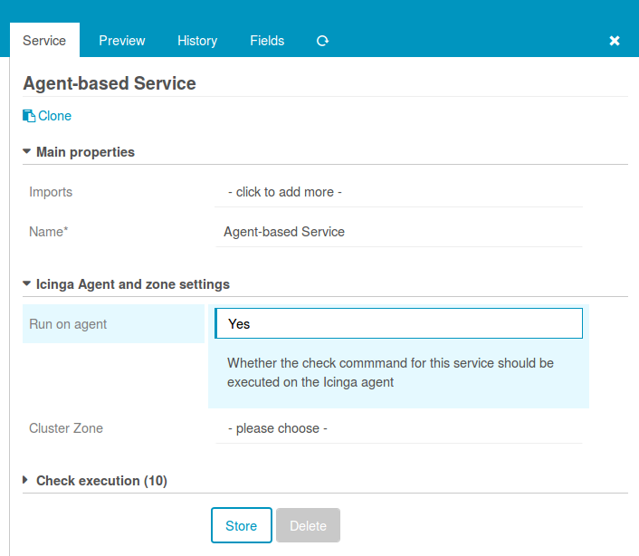
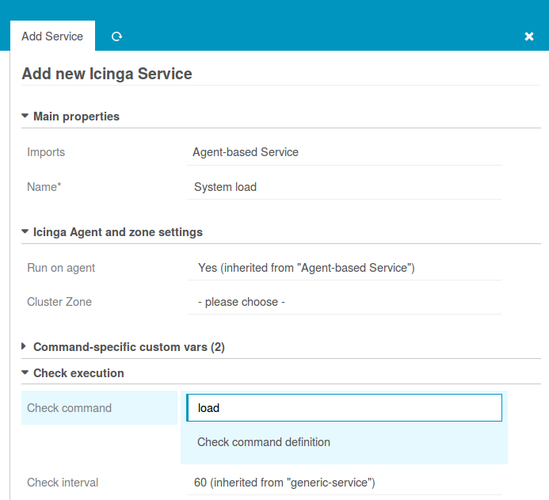
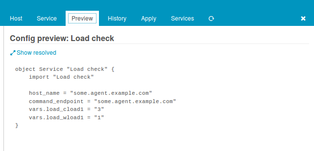
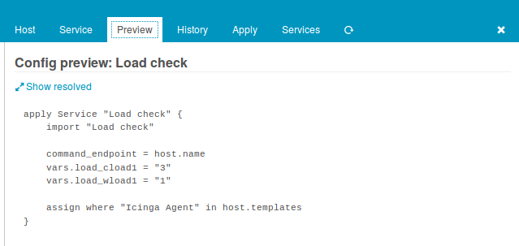
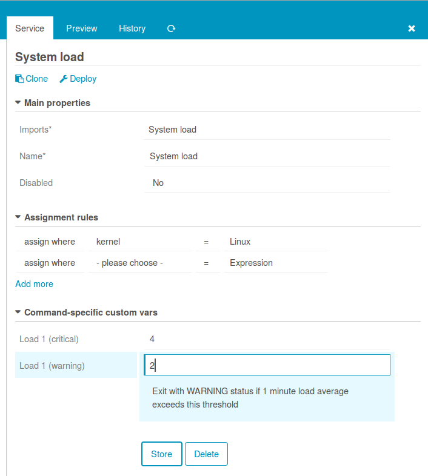

Working with Agents and Config Zones
====================================================================

Working with Icinga 2 Agents can be quite tricky, as each Agent needs
it's own Endpoint and Zone definition, correct parent, peering host and
log settings. There may always be reasons for a completely custom-made
configuration. I'd however strongly suggest to give the Director-assisted
variant at least a try first. It might safe you a lot of headaches.

Preparation
-----------

Agent settings are not available for modification directly on a host
object. This requires you to create an "Icinga Agent" template. You
could name it exactly like that, it's important to use meaningful names
for your templates.

As long as you're not using Satellite nodes a single Agent zone is all
you need. Otherwise you should create one Agent template per satellite
zone. If you want to move an Agent to a specific zone just assign it
the correct template and you're all done.

Usage
-----

Well, create a host, choose an Agent template, that's it:

Once you import the "Icinga Agent" template you'll see a new "Agent" tab.
It tries to assist you with the initial Agent setup by showing a sample
config:

The preview shows that the Icinga Director would deploy multiple objects
for your newly created host:

Create Agent-based services
---------------------------

Similar game for services that should run on your Agents. First create a
template with a meaningful name and define that Services inheriting from
this template should run on your Agents.

Please do not set a cluster zone, as this would rarely be necessary.
Agent-based services will always be deployed to their Agent's zone by
default. All you need to do now for services that should be executed
on your Agents ist importing that template:

Config preview shows that everything works as expected:

It's perfectly valid to assign services to host templates. Look how the
generated config differs now:

While a service added to a host template are implicitely rendered as
assign rules, you could of course also use your `Agent-based service`
template in custom apply rules:

